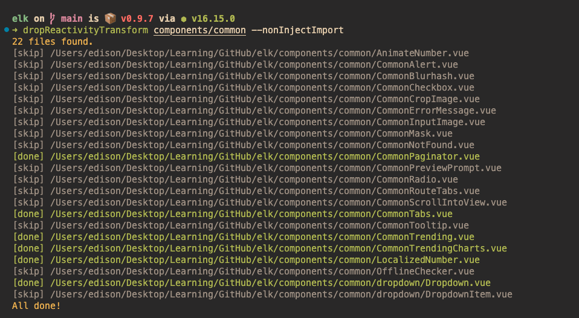

# drop-reactivity-transform 

`drop-reactivity-transform` is a powerful tool that enables you to quickly remove reactivity transform from your code base. It automatically scans all the `.vue`, `.ts`, and `.js` files in your target folder, transforms the code, and replaces the original code as needed - all in a matter of seconds.



## Installation
```bash
npm i -g drop-reactivity-transform
```
## Usage

To use drop-reactivity-transform, provide the target directory name as the first parameter. If no directory name is provided, the tool will use the current working directory by default. Here's an example:
```bash
dropReactivityTransform [target directory name]

# transform files in the src directory
dropReactivityTransform src

# transform files in the working directory
dropReactivityTransform . 

```
If you use [unplugin-auto-import](https://github.com/antfu/unplugin-auto-import) and don't want to import these APIs from Vue, you can use the `--nonInjectImport` flag as a second parameter. Here's an example:
```bash
dropReactivityTransform src --nonInjectImport
```
> **NOTE: `--nonInjectImport` on work for `.vue` files. For `.ts` and `.js` files will always inject import**

# Why use this tool?
Reactivity Transform was an experimental feature and has now been deprecated. It will be removed from Vue core in version 3.4. see [[⚠️ Dropped] Reactivity Transform
](https://github.com/vuejs/rfcs/discussions/369). If you don't want to use it anymore, this tool will help you convert your code and remove it.


# How it works?
The `drop-reactivity-transform` tool converts the following ReactivityTransform APIs to reactivity APIs:
- `$ref` -> `ref`
- `$computed` -> `computed`
- `$shallowRef` -> `shallowRef`
- `$customRef` -> `customRef`
- `$toRef` -> `toRef`

The [reactivity-transform](https://github.com/vuejs/core/tree/main/packages/reactivity-transform ) module has actually done the code to convert the above apis to the reactivity API internally. This tool takes that code and modifies it. 


# Examples of transformation
Here's some examples of the transformation:

### Before
```vue
<script setup lang="ts">
  let count = $ref<number>(0)
  console.log(count)
</script>
```
### After
```vue
<script setup lang="ts">
  import { ref } from 'vue'

  let count = ref<number>(0)
  console.log(count.value)
</script>
```

Here's an example of using the `--nonInjectImport` flag:
### Before
```vue
<script setup lang="ts">
  let count = $ref<number>(0)
  console.log(count)
</script>
```
### After
```vue
<script setup lang="ts">
  let count = ref<number>(0)
  console.log(count.value)
</script>
```

Object destructure
### Before
```ts
const { client } = $(useMasto())
```
### After
```ts
const __$temp_1 = (useMasto()),
  client = toRef(__$temp_1, 'client');
```
> **NOTE: For this usage scenario, you should format the code and modify the variable name `_$temp_` by yourself**